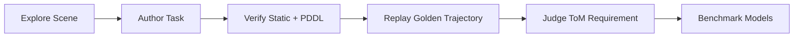

# EMTOM

[](#overview)
[](#setup)
[](/data4/parth/Partnr-EmToM/docs/benchmark-architecture.md)
[](/data4/parth/Partnr-EmToM/emtom/run_emtom.sh)

EMTOM is a research benchmark for **functional Theory of Mind** in embodied multi-agent environments. Agents act in Habitat scenes under **asymmetric information**, must **communicate**, and succeed only when they reason correctly about **what other agents know**.

The conceptual source of truth is [docs/benchmark-architecture.md](/data4/parth/Partnr-EmToM/docs/benchmark-architecture.md). The main operator entrypoint is [emtom/run_emtom.sh](/data4/parth/Partnr-EmToM/emtom/run_emtom.sh).

## Overview



| Layer | Owns |
| --- | --- |
| [emtom/pddl](/data4/parth/Partnr-EmToM/emtom/pddl) | Goal syntax, epistemic compilation, solvability checks |
| [emtom/task_gen](/data4/parth/Partnr-EmToM/emtom/task_gen) | Task authoring, validation, calibration, submission |
| [emtom/runner](/data4/parth/Partnr-EmToM/emtom/runner) | Habitat execution runtime |
| [emtom/cli](/data4/parth/Partnr-EmToM/emtom/cli) | User-facing command surface |
| [docs](/data4/parth/Partnr-EmToM/docs) | Benchmark semantics and architecture |

## Setup

### 1. Create the environment

```bash
conda create -n habitat-llm python=3.9.2 cmake=3.14.0 -y
conda activate habitat-llm
git submodule sync
git submodule update --init --recursive
```

```bash
conda install pytorch==2.4.1 torchvision==0.19.1 torchaudio==2.4.1 pytorch-cuda=12.4 -c pytorch -c nvidia -y
conda install habitat-sim=0.3.3 withbullet headless -c conda-forge -c aihabitat -y
pip install -e ./third_party/habitat-lab/habitat-lab
pip install -e ./third_party/habitat-lab/habitat-baselines
pip install -e ./third_party/transformers-CFG
pip install -r requirements.txt
pip install -e .
```

### 2. Download benchmark assets

```bash
python -m habitat_sim.utils.datasets_download --uids rearrange_task_assets hab_spot_arm hab3-episodes habitat_humanoids --data-path data/ --no-replace --no-prune
git clone https://huggingface.co/datasets/ai-habitat/OVMM_objects data/objects_ovmm --recursive

git clone -b partnr https://huggingface.co/datasets/hssd/hssd-hab data/versioned_data/hssd-hab
cd data/versioned_data/hssd-hab && git lfs pull && cd ../../..
ln -s versioned_data/hssd-hab data/hssd-hab

git clone https://huggingface.co/datasets/ai-habitat/partnr_episodes data/versioned_data/partnr_episodes
cd data/versioned_data/partnr_episodes && git lfs pull && cd ../../..
mkdir -p data/datasets
ln -s ../versioned_data/partnr_episodes data/datasets/partnr_episodes
ln -s versioned_data/partnr_episodes/checkpoints data/models
```

For the full PARTNR environment and dataset setup, use [docs/partnr/partnr.md](/data4/parth/Partnr-EmToM/docs/partnr/partnr.md).

### 3. Configure credentials

Create a repo-root `.env` or export the keys you need:

```bash
OPENAI_API_KEY=...
ANTHROPIC_API_KEY=...
GEMINI_API_KEY=...
AWS_ACCESS_KEY_ID=...
AWS_SECRET_ACCESS_KEY=...
AWS_DEFAULT_REGION=...
```

### 4. Know what needs a GPU

| GPU required | Lightweight |
| --- | --- |
| `explore` | `validate-task` |
| `generate` | `verify-static` |
| `new-scene` | `verify-pddl` |
| `test-task` | `judge` |
| `verify` |  |
| `benchmark` |  |
| `benchmark-suite` |  |

## Instructions

### How to get set up

1. Create and activate the `habitat-llm` Conda environment.
2. Install the repo dependencies.
3. Download the Habitat, HSSD, and PARTNR assets.
4. Add the API keys for the model providers you want to benchmark.
5. Use the full PARTNR setup guide here: [docs/partnr/partnr.md](/data4/parth/Partnr-EmToM/docs/partnr/partnr.md).

### How to use the benchmark commands

| Command | What it does | Typical use |
| --- | --- | --- |
| `explore` | Explore a scene with an LLM agent | Inspect mechanics and scene affordances |
| `generate` | Author new EMTOM tasks | Create tasks targeted to a benchmark model |
| `validate-task` | Validate task JSON structure | Fast pre-check before deeper verification |
| `verify-static` | Run static task checks | Catch schema and structural issues |
| `verify-pddl` | Check goal and solvability logic | Validate PDDL and epistemic structure |
| `verify` | Replay the golden trajectory in Habitat | Confirm the task is executable |
| `judge` | Score whether the task requires ToM | Filter weak or non-ToM tasks |
| `benchmark` | Run one model on one task set | Main evaluation command |
| `benchmark-suite` | Run many models on one task set | Multi-model comparison in one tmux run |
| `campaign` | Manage the active benchmark campaign | Track a canonical benchmark set |
| `bulk_generate` | Generate tasks across GPUs in parallel | Larger task-authoring batches |

### Recommended workflow

1. `explore` a scene if you are authoring new tasks.
2. `generate` a batch of candidate tasks.
3. `validate-task`, `verify-static`, `verify-pddl`, `verify`, and `judge` before submission.
4. `benchmark` a single model when testing locally.
5. `benchmark-suite` when comparing several models on the same task directory.

## Quick Start

### Explore

```bash
./emtom/run_emtom.sh explore --steps 30 --model gpt-5.4
```

### Generate

```bash
./emtom/run_emtom.sh generate --task-gen-agent mini --model gpt-5.4 --target-model gpt-5.4 --seed-tasks-dir data/emtom/tasks --num-tasks 4
```

### Verify and judge

```bash
./emtom/run_emtom.sh validate-task --task data/emtom/tasks/my_task.json
./emtom/run_emtom.sh verify-static --task data/emtom/tasks/my_task.json
./emtom/run_emtom.sh verify-pddl --task data/emtom/tasks/my_task.json
./emtom/run_emtom.sh verify --task data/emtom/tasks/my_task.json
./emtom/run_emtom.sh judge --task data/emtom/tasks/my_task.json --model gpt-5.4
```

### Benchmark

```bash
./emtom/run_emtom.sh benchmark --tasks-dir data/emtom/tasks_claude --model gpt-5.4 --max-workers 8
```

```bash
./emtom/run_emtom.sh benchmark --tasks-dir data/emtom/tasks_claude --model gpt-5.4 --max-workers 8 --num-times 3
```

```bash
./emtom/run_emtom.sh benchmark-suite --tasks-dir data/emtom/tasks_claude --models opus haiku gpt-5.4 gpt-5.4-mini --max-workers 8 --num-times 3
```

Repeated benchmark runs report mean pass rate, pass-rate standard deviation, `pass@k`, and `pass^k` with `k = --num-times`, using the exact `pass@k = 1 - C(n-c, k) / C(n, k)` and `pass^k = (c/n)^k` formulas.

### Bulk generation

```bash
./emtom/bulk_generate.sh --num-tasks 8 --task-gen-agent mini --model gpt-5.4
```

## What The Benchmark Measures

```text
Functional success   = agents actually complete the task
Literal ToM probe    = agents answer explicit belief questions at the end
```

These should be reported separately.

## Operator Notes

- Use [docs/benchmark-architecture.md](/data4/parth/Partnr-EmToM/docs/benchmark-architecture.md) as the authoritative benchmark description.
- Use [emtom/run_emtom.sh](/data4/parth/Partnr-EmToM/emtom/run_emtom.sh) as the main entrypoint.
- Keep exactly one active campaign in `data/emtom/results/`.
- Submitted benchmark tasks must stay grounded in real dataset `scene_id` and `episode_id`.
- When benchmark architecture changes, update `docs/*.md` in the same change.

## Pointers

- Architecture: [docs/benchmark-architecture.md](/data4/parth/Partnr-EmToM/docs/benchmark-architecture.md)
- Main CLI: [emtom/run_emtom.sh](/data4/parth/Partnr-EmToM/emtom/run_emtom.sh)
- Bulk generation: [emtom/bulk_generate.sh](/data4/parth/Partnr-EmToM/emtom/bulk_generate.sh)
- PARTNR background: [docs/partnr/partnr.md](/data4/parth/Partnr-EmToM/docs/partnr/partnr.md)
